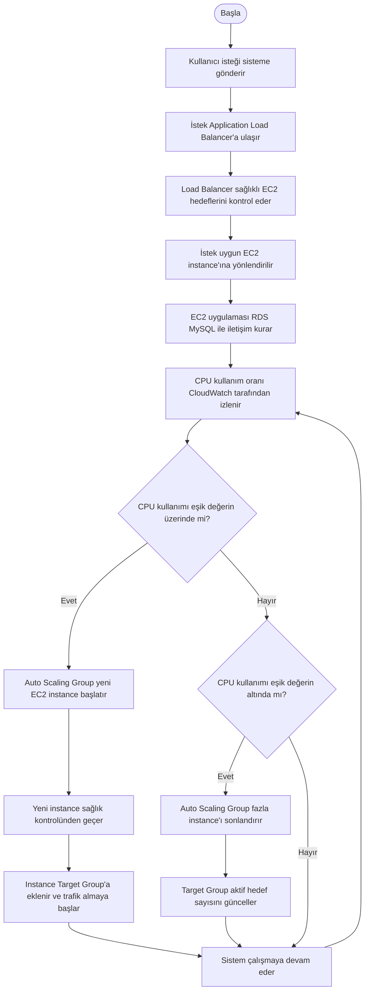
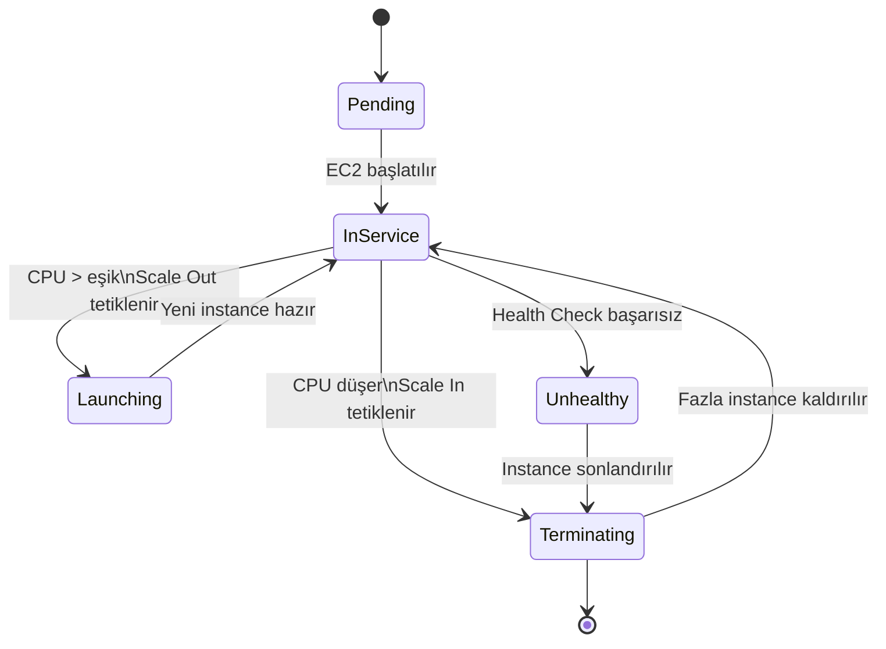
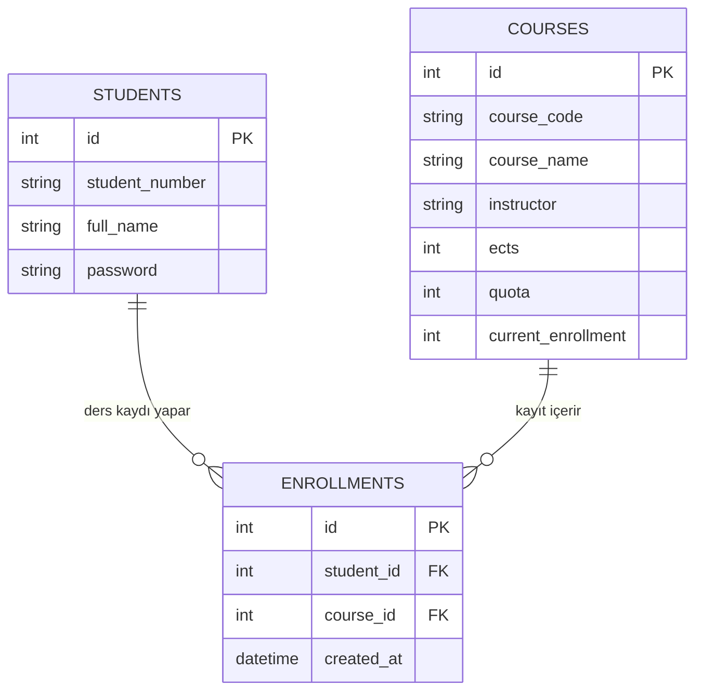

# Course Scale System 
<div align="center">


</div>
Bu proje, üniversite ders kayıt sistemlerinin yoğunluk altında nasıl davrandığını incelemek ve bulut bilişim ile ölçeklenebilirliğini analiz etmek amacıyla geliştirilmiştir.

## Proje Amacı
Bu projenin amacı, ders kayıt dönemlerinde oluşan yoğunluk problemlerini simüle etmek ve bulut tabanlı çözümler ile sistem performansını iyileştirmektir.

##  Kullanılan Teknolojiler
- HTML
- CSS
- JavaScript
- Node.js (Express)
- AWS EC2

## Bulut Ortamı
Proje AWS EC2 üzerinde çalıştırılmıştır ve internet üzerinden erişilebilir hale getirilmiştir.

## Özellikler
- Ders seçme sistemi
- AKTS (kredi) kontrolü
- Sistem yoğunluk simülasyonu (CPU yükü)
- Backend API entegrasyonu
- Yük testine uygun yapı (JMeter)

##  Test
Sistem performansı Apache JMeter kullanılarak test edilmiştir. Farklı kullanıcı sayıları ile sistemin tepkisi analiz edilmiştir.

##  Proje Hedefi
Bu proje ile bulut tabanlı sistemlerin yüksek trafik altında daha verimli çalıştığı ve ölçeklenebilir olduğu gösterilmiştir.
---
## Akış Şeması


---
## Durum Diyagramı


---
## Varlık İlişki Diyagramı


---
##  Projeyi Çalıştırma
```bash
npm install
npm start
